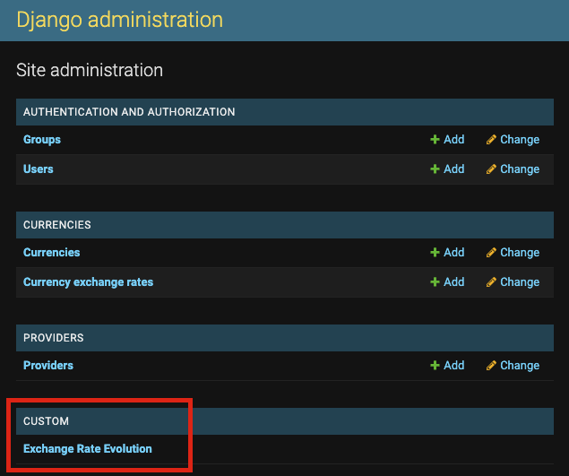
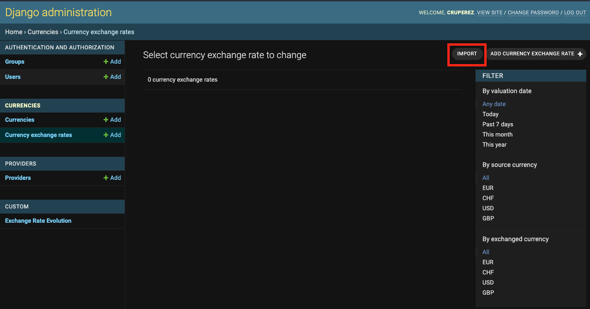
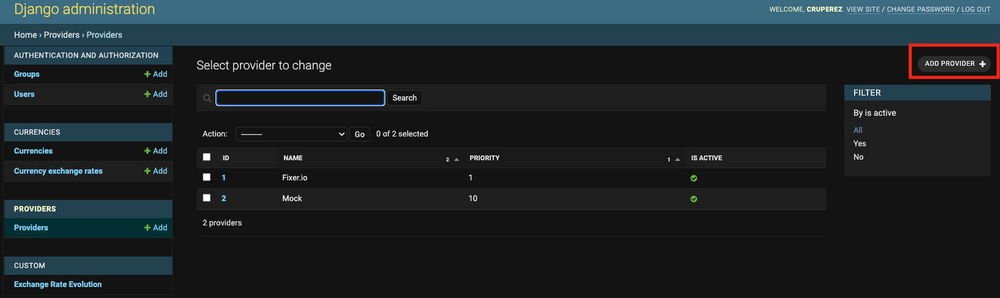

# Currency
Web platform that allows users to calculate currency exchange rates.

## Setup
Create environment variables file named .env in the root directory of the project. This file will have the variables of the .env.sample file.

Configure a Cronjob that calls the Django command `python manage.py load_exchange_rates_data`. This command call the providers to request the exchange rates.


## Run
You can run with docker-compose as follows:

```
docker-compose build
docker-compose run web python manage.py migrate
docker-compose up
```

When you call `docker-compose run web python manage.py migrate`:
- The app "currencies" has a migration to populate currencies: `0002_populate_currencies.py`
- The app "providers" has a migration to populate providers: `0002_populate_providers.py`

For populate the DB with some data you can call manually this command:

```
docker-compose exec web python manage.py load_exchange_rates_data --from_date yyyy-mm-dd
```

Replace "yyyy-mm-dd" by the from date you want to get exchange rates data


### Create super user to access in Django Admin
`docker-compose exec web python manage.py createsuperuser`


## Access to Exchange rate evolution

For access to exchange rate evolution  you have to login in the Django admin:




## How to import CurrencyExchangeRate data:

Go to Django admin / Currency exchange rates and click to import:



And you can import a .json file with the following structure:

```
[
    {
        "source_currency": 4,
        "exchanged_currency": 3,
        "valuation_date": "2022-07-04",
        "rate_value": "1.212107"
    },
    {
        "source_currency": 4,
        "exchanged_currency": 2,
        "valuation_date": "2022-07-04",
        "rate_value": "1.164720"
    },
    {
        "source_currency": 3,
        "exchanged_currency": 4,
        "valuation_date": "2022-07-04",
        "rate_value": "0.825009"
    },
    {
        "source_currency": 3,
        "exchanged_currency": 2,
        "valuation_date": "2022-07-04",
        "rate_value": "0.960905"
    },
    {
        "source_currency": 2,
        "exchanged_currency": 4,
        "valuation_date": "2022-07-04",
        "rate_value": "0.858576"
    }
]
```


## How to add providers

Add implementation code in a file in providers/integrations/provider_name.py

The class of this integration must inherit from `providers.integrations.base.BaseProvider`

Add in currency/settings.py the path of this provider as follows:

```
FIXER_PROVIDER = 'fixer'
MOCK_PROVIDER = 'mock'
PROVIDER_ADAPTERS = (
    (FIXER_PROVIDER, 'providers.integrations.fixer.FixerProvider'),
    (MOCK_PROVIDER, 'providers.integrations.mock.MockProvider'),
)
```

Register the provider in the DB, for example from Django admin:




## Improvements

- Add testing:
  - End-to-end
  - Unitary
- Split settings.py, for example:
  - django.py
  - third_party.py
  - project.py
  - database.py
- Use of Python type hint
- Auto-generated documentation for API with Swagger or similar tool
- Add Provider ForeignKey to CurrencyExchangeRate for better tracking
- Dynamic quantity of pairs in admin chart exchange_rate_evolution
- Improve obtaining the dataset from admin chart exchange_rate_evolution
